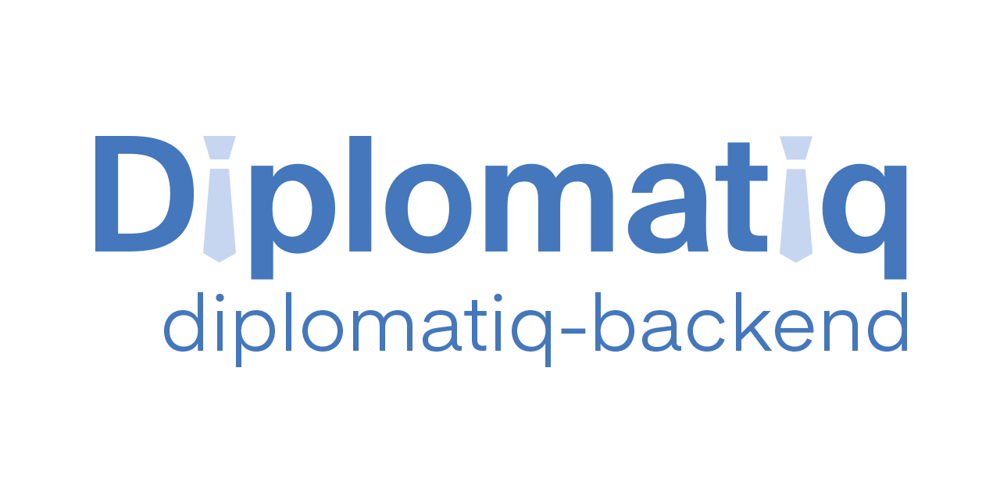

  

Networking for the diplomatiq world.

[https://api.diplomatiq.org](https://api.diplomatiq.org)

---

## Basics

The application is implemented with the Spring Boot framework.

After something is pushed to the `develop` branch, the branch is immediately deployed to the `develop` slot of the `diplomatiq-backend` resource in Azure: [https://api.diplomatiq.org/?x-ms-routing-name=develop](https://app.diplomatiq.org/?x-ms-routing-name=develop)

Same for the `master` branch, but after a push, the branch is deployed to the `staging` slot, which gets auto-swapped into production in order to reach the zen of zero-downtime deployment.

## OpenAPI documentation

The detailed documentation of the API is available in OpenAPI 3 format on [https://api.diplomatiq.org/openapi-documentation/v3/ui](https://api.diplomatiq.org/openapi-documentation/v3/ui). The documentation looks better in Chrome or Firefox, while for some reason, Swagger UI keeps having problems with Safari.

For client generation, the documentation is also available as a machine-readable JSON on [https://api.diplomatiq.org/openapi-documentation/v3/api](https://api.diplomatiq.org/openapi-documentation/v3/api).

## Development

See [CONTRIBUTING.md](https://github.com/Diplomatiq/diplomatiq-backend/blob/develop/CONTRIBUTING.md) for details.

---

Copyright (c) 2018 Diplomatiq
